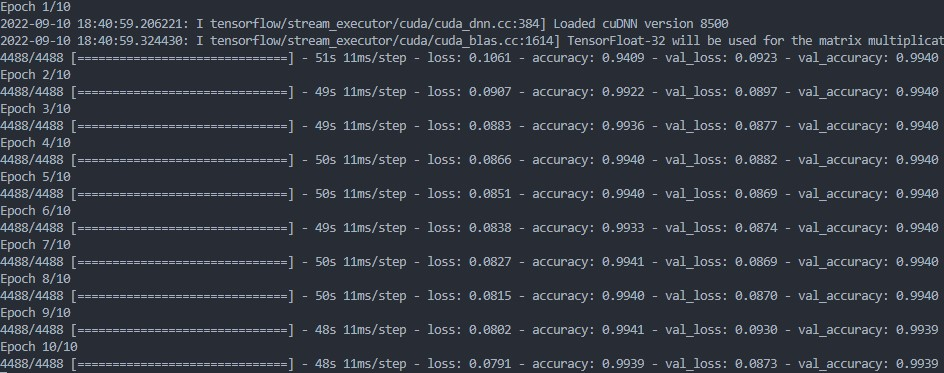
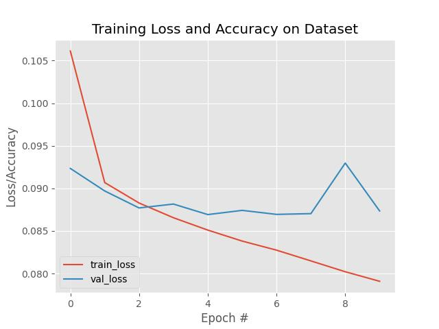

# WARNING: THIS PROJECT CONTAINS DATASETS THAT USERS MAY FIND OFFENSIVE IF READ.

## Cruel Comment Classifier (CCC)
##### The purpose of this classifier is to determine the level of toxicity of a sentence. It uses Keras LSTM (Tensorflow backend) to identify a sentence as one of these 6 categories: **TOXIC, EXTREMELY TOXIC, OBSCENE, THREAT, INSULT, IDENTITY HATE**. 

##### This project is based on the 2017 Kaggle competition problem. The dataset provided for this problem was used to train the NN. It can be found here: 

> https://www.kaggle.com/competitions/jigsaw-toxic-comment-classification-challenge/data

## Results
##### Below is the result of running the NN on the test/train data:

##### An accuracy of 99.4% is high, and thus the model is quite accurate at a glance. TODO - Get confusion matrix to verify

##### Below is the loss vs. the number of epochs for both the test and train data: 

### **Future plans:** implement the model into some other program that can detect toxic sentences and do something with it.

